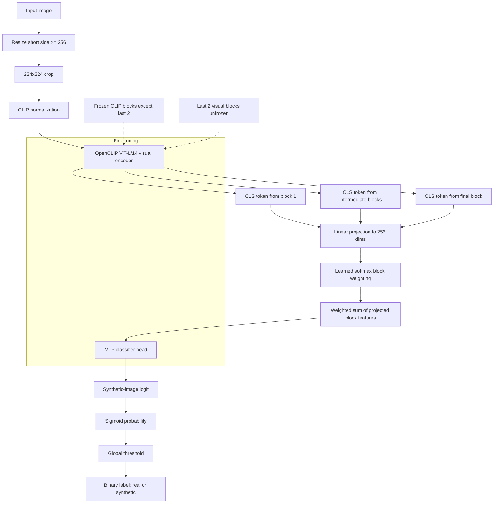

# Methodology and Experiments

## Methodology

### Task Setting

We address Task A of the MediaEval 2026 Synthetic Image Detection challenge in
the constrained setting. The goal is to classify each image as real or
synthetic and to produce a submission CSV containing the image filename, the
probability of being synthetic, a binary label, and a single global decision
threshold. We use only the official constrained training data available locally:
Corvi latent-diffusion synthetic images and COCO real images. The ITW-SM
validation set is used for model selection, calibration, and robustness
analysis.

### Data Preparation

We build a metadata index over the train, validation, and test image folders.
Each record stores the filename, absolute path, split, source dataset, label
when available, image dimensions, and file format. For the final constrained
run, we sample up to 75,000 real training images and 75,000 synthetic training
images using a fixed random seed. The validation set is kept unchanged and is
used only for evaluation and threshold selection.

Training images are resized so the short side is at least 256 pixels, then a
224x224 crop is sampled. We apply standard CLIP normalization and use moderate
data augmentation: horizontal flipping, mild color jitter, small rotations,
JPEG recompression, and resize-degradation simulation. To reduce mismatch with
small social-media images, training samples with short side below 512 pixels are
oversampled with a factor of 1.25 while preserving class balance in the sampler.

At evaluation and test time, we use a deterministic center crop after resizing
the short side to at least 256 pixels. Earlier multi-crop experiments were not
retained because they reduced the overall validation metrics.

### Model

Our detector is based on OpenCLIP ViT-L/14 pretrained with the OpenAI weights.
Rather than using only the final image embedding, we collect the CLS-token
representation from every visual transformer block through forward hooks. These
intermediate block features are projected to a 256-dimensional space and fused
with learned softmax block weights. The fused representation is passed to a
small MLP classifier with LayerNorm, GELU activations, dropout, and a single
binary logit output.

The final model partially fine-tunes CLIP by unfreezing the last two visual
transformer blocks, the post-transformer normalization, and the visual
projection parameters. All earlier CLIP layers remain frozen. The classifier
head is trained with learning rate `3e-4`, while the unfrozen CLIP parameters
use learning rate `1e-5`. We train with AdamW, weight decay `1e-4`, mixed
precision, gradient clipping at norm `1.0`, batch size `16`, and binary
cross-entropy with logits.

The final architecture is summarized below.

### Calibration and Submission

Model checkpoints are selected by validation ROC AUC, using average precision
as a tie-breaker. After training, we calibrate the operating point on validation
predictions by selecting the exact observed probability threshold that maximizes
F1. This was important because the strongest models produced highly saturated
scores and useful thresholds were much smaller than those found by a coarse
linear sweep over `[0, 1]`.

For the final pinned run, the selected global threshold is
`0.0001303297467529`. Test predictions are exported with this same threshold
repeated in every row. The final constrained submission file contains 10,000
rows, one for each challenge test image, and uses bare filenames as `image_id`.

## Experiments

### Evaluation Protocol

We evaluate primarily by validation F1 after threshold calibration, because the
submission format requires binary labels from a single global threshold. We also
track accuracy, ROC AUC, average precision, and robustness metrics. Robustness
checks include performance on validation images grouped by short-side image
size, JPEG recompression at multiple qualities, and a laundering transform that
simulates resizing and recropping.

### Main Results

The final pinned model is:

`constrained_clip_l14_unfreeze_last2_smallimg_moredata_epochs3_20260424_204835`

It uses 75k real plus 75k synthetic training samples, small-image oversampling,
partial unfreezing of the last two CLIP visual blocks, and three training
epochs.

| Run                              | Key change                              | Accuracy |     F1 | ROC AUC |     AP |
| -------------------------------- | --------------------------------------- | -------: | -----: | ------: | -----: |
| Frozen CLIP small-image baseline | Best frozen-backbone recipe             |   0.6991 | 0.7335 |  0.7796 | 0.7667 |
| Logit ensemble                   | Ensemble of more-data and unfreeze runs |   0.6993 | 0.7425 |  0.7918 | 0.7797 |
| Unfreeze last two blocks         | 75k+75k, two epochs                     |   0.7116 | 0.7533 |  0.8074 | 0.7928 |
| Final pinned model               | 75k+75k, three epochs                   |   0.7318 | 0.7555 |  0.8114 | 0.7963 |
| Patchmask backup                 | Mild patch masking, two epochs          |   0.7311 | 0.7553 |  0.8099 | 0.7955 |

The final model improved substantially over the best frozen-backbone baseline:
F1 increased from `0.7335` to `0.7555`, ROC AUC from `0.7796` to `0.8114`, and
average precision from `0.7667` to `0.7963`.

### Ablation Findings

Partial CLIP fine-tuning was the most important improvement. Early frozen-head
runs were stable but saturated around F1 `0.73`. Unfreezing the last two visual
transformer blocks improved ranking metrics and, after exact threshold
calibration, also improved calibrated F1.

Increasing the training cap from 50k+50k to 75k+75k helped when combined with
partial unfreezing, but increasing further to 100k+100k hurt performance. This
suggests that simply adding more constrained data was less important than
matching the in-the-wild validation distribution through the right training
recipe.

Patch masking helped small-image robustness but did not beat the final pinned
model overall. The strongest patchmask backup reached nearly the same F1
(`0.7553`) and had better performance on the `<512` bucket, but its ROC AUC and
average precision were slightly lower than the selected model.

Multi-crop inference was tested earlier but was not retained. It improved some
small-image behavior but reduced the overall validation ranking and robustness
metrics.

### Robustness Results

| Run                   | `<512` F1 | Laundering ROC AUC | JPEG85 ROC AUC |
| --------------------- | --------: | -----------------: | -------------: |
| Final pinned model    |    0.5833 |             0.7826 |         0.7716 |
| Patchmask backup      |    0.6126 |             0.7838 |         0.7670 |
| Three-epoch patchmask |    0.6261 |             0.7735 |         0.7662 |
| Seed 2025 variant     |    0.5766 |             0.7818 |         0.7735 |
| Two-epoch predecessor |    0.5818 |             0.7773 |         0.7728 |

The final pinned model gives the best overall validation metrics, while the
patchmask variants remain useful robustness references. The main remaining
weakness is the `<512` image bucket, where patch masking improves F1 but costs
some overall ranking performance.

### Final Submission

The final constrained submission is generated from the pinned checkpoint and
uses the calibrated threshold `0.0001303297467529`. The exported CSV was
validated to contain exactly 10,000 rows, no duplicate image IDs, no missing
test filenames, probabilities in `[0, 1]`, binary labels, and labels consistent
with `prob >= threshold`.
