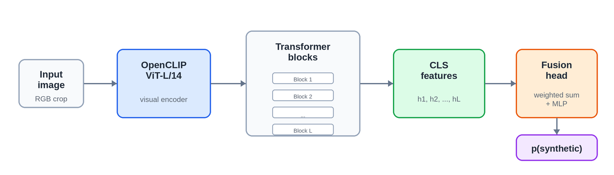
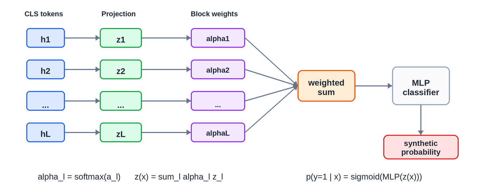
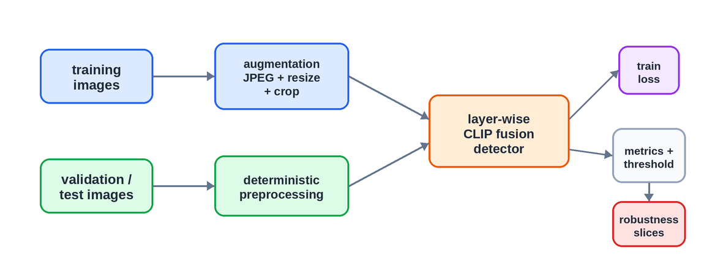

# Layer-Wise CLIP Feature Fusion for Synthetic Image Detection

**Authors:** Jeng Wen Joshua Lean

## Abstract

Synthetic image detection aims to determine whether an image is real or generated. We study a CLIP-based detector for MediaEval 2026 Synthetic Image Detection Task A that uses layer-wise visual representations from a pretrained ViT-L/14 image encoder. Inspired by prior work on intermediate CLIP representations for synthetic image detection, the detector learns to fuse class-token features from all visual transformer blocks instead of relying only on the final encoder embedding. The system is evaluated in two training regimes: a constrained setting using COCO real images and Corvi synthetic images, and an open-data setting that additionally includes TrueFake social images. On a local in-the-wild validation split, the constrained model achieves F1 0.7555, ROC AUC 0.8114, and average precision 0.7963. The open-data model improves to F1 0.7916, ROC AUC 0.8643, and average precision 0.8541. These results suggest that intermediate CLIP features provide a practical representation for synthetic image detection, while broader training data improves robustness to social-media-style imagery.

## 1. Introduction

Recent generative models can produce visually convincing images at scale, creating a need for reliable synthetic image detection in media verification, platform moderation, and forensic analysis. The task is challenging because generated images can be post-processed, resized, recompressed, cropped, or distributed through social platforms, all of which can obscure generation artifacts.

Vision-language foundation models such as CLIP learn broad visual representations from large-scale image-text supervision [Radford2021]. These representations are attractive for synthetic image detection because they encode both local and semantic visual cues. Cozzolino et al. showed that even simple classifiers over frozen CLIP features can provide strong transfer for AI-generated image detection [Cozzolino2024]. However, the final embedding of a pretrained encoder may not preserve every signal useful for forensics. Artifacts associated with generation can appear at different abstraction levels, from texture and compression patterns to object-level inconsistencies.

This paper describes a detector that uses intermediate visual transformer features from OpenCLIP ViT-L/14. The design follows the core observation of RINE: intermediate encoder blocks can retain forensic traces that may be attenuated in the final semantic representation [Koutlis2024]. The model extracts the class-token representation from each transformer block, learns a soft weighting over blocks, and classifies the weighted feature as real or synthetic. We evaluate the same architecture under constrained and open-data training conditions and report validation metrics, threshold calibration behavior, and robustness to common post-processing transformations.

The training and evaluation protocol is also motivated by recent evidence that synthetic image detectors can exploit dataset shortcuts, including JPEG compression and image resolution biases [Grommelt2024]. We therefore use transformation-aware augmentation inspired by SAFE [Li2025] and explicitly report robustness under JPEG recompression, resize/crop laundering, and image-size buckets.

Our contribution is a compact and reproducible synthetic image detection pipeline based on layer-wise CLIP feature fusion. We do not claim a new foundation model or a comprehensive benchmark study. Instead, the work demonstrates that a lightweight classifier over pretrained intermediate features, combined with transformation-aware training and calibrated thresholding, can perform competitively in a practical synthetic image detection setting.

## 2. Method

### 2.1 Problem Formulation

Given an RGB image \(x\), the goal is to predict a binary label \(y \in \{0,1\}\), where \(y=0\) denotes a real image and \(y=1\) denotes a synthetic image. The model outputs a probability \(p(y=1 \mid x)\), which is converted to a binary prediction using a validation-calibrated threshold.

### 2.2 Image Preprocessing and Augmentation

All images are converted to RGB and normalized using CLIP image statistics. During training, images are resized when necessary, randomly cropped to \(224 \times 224\), horizontally flipped, color jittered, mildly rotated, recompressed as JPEG with random quality, and degraded through downsampling and upsampling. These augmentations are intended to reduce sensitivity to common distribution shifts such as web compression, resizing, and social-media laundering. This choice follows the view that transformations are central to generalization in synthetic image detection, while overly narrow reliance on high-frequency artifacts can reduce robustness after compression [Li2025].

At validation and test time, the model uses deterministic crops. The reported runs use single-crop evaluation. Multi-crop evaluation is supported by averaging crop logits, but it is not used in the active reported configurations.

### 2.3 Layer-Wise CLIP Representation

The detector uses a pretrained OpenCLIP ViT-L/14 visual encoder. Let \(h_l(x)\) denote the class-token feature produced by transformer block \(l\), for \(l = 1,\ldots,L\). Rather than using only \(h_L(x)\), we collect features from all visual transformer blocks, following the motivation that earlier and middle layers may preserve lower-level forensic traces better than the final semantic representation [Koutlis2024]:

\[
H(x) = \{h_1(x), h_2(x), \ldots, h_L(x)\}.
\]

Each block feature is projected to a shared representation space:

\[
z_l = W_p h_l + b_p.
\]

The model learns one scalar fusion parameter \(a_l\) for each block. These parameters are normalized with a softmax:

\[
\alpha_l = \frac{\exp(a_l)}{\sum_{j=1}^{L} \exp(a_j)}.
\]

The final image representation is a convex combination of projected block features:

\[
z(x) = \sum_{l=1}^{L} \alpha_l z_l.
\]

A small multilayer classifier maps \(z(x)\) to a scalar logit \(s(x)\), and the synthetic probability is computed as

\[
p(y=1 \mid x) = \sigma(s(x)).
\]

This design lets the model learn which abstraction levels are most useful for the detection task while keeping the task-specific head compact.

### 2.4 Training Objective

The model is trained with binary cross-entropy on logits:

\[
\mathcal{L}(x,y) =
-y \log \sigma(s(x)) - (1-y)\log(1-\sigma(s(x))).
\]

Only the classifier head and the final two transformer blocks of the CLIP visual encoder are fine-tuned in the reported runs. The rest of the pretrained encoder remains frozen. This provides limited adaptation to the synthetic image detection task while reducing the risk of overfitting and lowering computational cost.

### 2.5 Threshold Calibration

Because the model is used for binary decisions, validation probabilities are used to select a classification threshold. We choose the threshold that maximizes F1 over the observed validation scores. This avoids relying on a fixed threshold such as 0.5, which can be suboptimal when predicted probabilities are poorly calibrated or highly saturated.

## 3. Experimental Setup

### 3.1 Data

We evaluate two training regimes.

The constrained regime uses COCO train2017 images as real examples and Corvi latent-diffusion images as synthetic examples. The active configuration caps training at 75,000 real and 75,000 synthetic images.

The open-data regime uses the constrained data and adds TrueFake social images. The resulting local metadata index contains 135,000 real and 135,000 synthetic training images: 75,000 COCO real, 75,000 Corvi synthetic, 60,000 TrueFake social real, and 60,000 TrueFake social synthetic images.

Both regimes use the same local validation and test splits. The validation split contains 5,000 real and 5,000 synthetic in-the-wild images. The test split contains 10,000 unlabeled images. Since official hidden test labels are not available in the repository, all reported metrics are local validation results.

### 3.2 Optimization

Both reported models use OpenCLIP ViT-L/14 with OpenAI pretrained weights. Inputs are \(224 \times 224\), and training uses batch size 16 for three epochs. The optimizer is AdamW with weight decay \(10^{-4}\). The classifier head uses learning rate \(3 \times 10^{-4}\), while the unfrozen backbone blocks use learning rate \(10^{-5}\). Mixed precision is enabled when CUDA is available. Gradients are clipped to norm 1.0. The random seed is 1337.

The best checkpoint is selected using validation ROC AUC, with average precision used as a tie-breaker. After checkpoint selection, a separate calibration pass selects the F1-maximizing threshold on validation predictions.

### 3.3 Metrics

We report accuracy, precision, recall, F1, ROC AUC, and average precision. F1, accuracy, precision, and recall depend on the calibrated threshold. ROC AUC and average precision measure ranking quality and are threshold-independent.

Motivated by prior warnings about JPEG and resolution shortcuts in generated-image detection datasets [Grommelt2024], we also evaluate robustness under three post-processing settings:

- JPEG recompression at qualities 95, 85, and 75.
- Resize/crop laundering, consisting of downsampling, upsampling, cropping, and resizing.
- Image-size buckets based on the shorter side of the original image.

## 4. Results

### 4.1 Main Validation Results

Table 1 reports local validation performance for the constrained and open-data runs. The open-data model improves all reported ranking and thresholded metrics.

| Run         | Training data                                                          | Threshold | Accuracy | Precision | Recall |     F1 | ROC AUC |     AP |
| ----------- | ---------------------------------------------------------------------- | --------: | -------: | --------: | -----: | -----: | ------: | -----: |
| Constrained | 75k COCO real + 75k Corvi synthetic                                    |  0.000130 |   0.7318 |    0.6941 | 0.8288 | 0.7555 |  0.8114 | 0.7963 |
| Open data   | Constrained + 60k TrueFake social real + 60k TrueFake social synthetic |  0.001221 |   0.7640 |    0.7087 | 0.8964 | 0.7916 |  0.8643 | 0.8541 |

**Table 1.** Local validation results. AP denotes average precision. These are not official hidden-test results.

The open-data run improves F1 by 0.0361 and ROC AUC by 0.0530 over the constrained run. The largest absolute gain appears in recall, increasing from 0.8288 to 0.8964, suggesting that the additional social-media training data helps the model identify more synthetic images at the selected threshold.

### 4.2 Robustness Results

Table 2 summarizes selected robustness checks. The open-data model is consistently stronger under JPEG recompression, laundering, and small-image evaluation.

| Run         | JPEG 85 F1 | JPEG 85 ROC AUC | Laundering F1 | Laundering ROC AUC | Short side <512 F1 |
| ----------- | ---------: | --------------: | ------------: | -----------------: | -----------------: |
| Constrained |     0.7247 |          0.7716 |        0.7162 |             0.7826 |             0.5833 |
| Open data   |     0.7631 |          0.8385 |        0.7379 |             0.8212 |             0.7156 |

**Table 2.** Selected local robustness results.

The constrained model is particularly weak on images whose shorter side is below 512 pixels. The open-data model substantially improves this bucket, but small and post-processed images remain plausible failure cases.

## 5. Discussion

The results support two main observations. First, layer-wise CLIP features are useful for synthetic image detection: a compact fusion head over intermediate representations achieves reasonable validation performance without full end-to-end training of the large visual encoder. This is consistent with prior CLIP-based detection results [Cozzolino2024] and with the RINE hypothesis that intermediate representations retain useful forensic information [Koutlis2024]. Second, training data diversity matters. Adding TrueFake social images improves both the main validation metrics and robustness checks, especially for small images and post-processed inputs.

The calibrated thresholds are much smaller than 0.5. This indicates that the raw probabilities are not well calibrated in an absolute probabilistic sense, even though the ranking metrics remain informative. For deployment, threshold selection should therefore be treated as part of the evaluation protocol and recalibrated when the target distribution changes.

The robustness results also show that common post-processing operations remain challenging. JPEG recompression and laundering reduce performance relative to the clean validation setting. This is important because real-world synthetic images are often shared after resizing, recompression, screenshotting, or platform-specific processing. These findings align with prior concerns that detectors can learn dataset-specific compression or resolution artifacts rather than generator-invariant evidence [Grommelt2024].

More complex alternatives, such as forgery-aware adaptive transformer architectures, may offer stronger generalization but introduce additional modules and training complexity [Liu2024]. Our design favors a lightweight representation-learning route: use a strong pretrained encoder, expose intermediate features, and spend the limited training budget on the fusion head and final encoder adaptation.

## 6. Conclusion

We presented a synthetic image detector based on layer-wise fusion of pretrained CLIP visual features. The method learns a soft weighting over intermediate transformer block representations and trains a compact binary classifier for real-vs-synthetic prediction. On local validation data, the open-data model outperforms the constrained model, indicating that broader training data improves both accuracy and robustness.

## References

- [Radford2021] A. Radford, J. W. Kim, C. Hallacy, A. Ramesh, G. Goh, S. Agarwal, G. Sastry, A. Askell, P. Mishkin, J. Clark, G. Krueger, and I. Sutskever. "Learning Transferable Visual Models From Natural Language Supervision." In _Proceedings of the 38th International Conference on Machine Learning (ICML)_, PMLR, vol. 139, pp. 8748–8763, 2021.

- [Koutlis2024] C. Koutlis and S. Papadopoulos. "Leveraging Representations from Intermediate Encoder-Blocks for Synthetic Image Detection." In _Computer Vision – ECCV 2024_, pp. 394–411, 2024. doi: 10.48550/arXiv.2402.19091.

- [Cozzolino2024] D. Cozzolino, G. Poggi, R. Corvi, M. Nießner, and L. Verdoliva. "Raising the Bar of AI-generated Image Detection with CLIP." In _Proceedings of the IEEE/CVF Conference on Computer Vision and Pattern Recognition Workshops (CVPRW)_, pp. 4356–4366, 2024. doi: 10.1109/CVPRW63382.2024.00439.

- [Grommelt2024] P. Grommelt, L. Weiss, F.-J. Pfreundt, and J. Keuper. "Fake or JPEG? Revealing Common Biases in Generated Image Detection Datasets." In _Computer Vision – ECCV 2024 Workshops_, pp. 80–95, 2025. doi: 10.1007/978-3-031-92089-9_6.

- [Li2025] O. Li, J. Cai, Y. Hao, X. Jiang, Y. Hu, and F. Feng. "Improving Synthetic Image Detection Towards Generalization: An Image Transformation Perspective." In _Proceedings of the 31st ACM SIGKDD Conference on Knowledge Discovery and Data Mining (KDD ’25)_, 2025. doi: 10.1145/3690624.3709392.

- [Corvi2023] R. Corvi, D. Cozzolino, G. Zingarini, G. Poggi, K. Nagano, and L. Verdoliva. "On the Detection of Synthetic Images Generated by Diffusion Models." In _ICASSP 2023 – IEEE International Conference on Acoustics, Speech and Signal Processing_, pp. 1–5, 2023. doi: 10.1109/ICASSP49357.2023.10095167.

- [Liu2024] H. Liu, Z. Tan, C. Tan, Y. Wei, Y. Zhao, and J. Wang. "Forgery-aware Adaptive Transformer for Generalizable Synthetic Image Detection." In _Proceedings of the IEEE/CVF Conference on Computer Vision and Pattern Recognition (CVPR)_, pp. 10770–10780, 2024. doi: 10.1109/CVPR52733.2024.01024.

- [Ilharco2021] G. Ilharco, M. Wortsman, R. Wightman, C. Gordon, N. Carlini, R. Taori, A. Dave, V. Shankar, H. Namkoong, J. Miller, H. Hajishirzi, A. Farhadi, and L. Schmidt. "OpenCLIP." Zenodo, 2021. doi: 10.5281/zenodo.5143773.

- [MediaEval2026] MediaEval Benchmark. "Synthetic Images: Advancing Detection and Localization of Generative AI Used in Real-World Online Images." MediaEval 2026 Task Overview, 2026.

- [Lin2014] T.-Y. Lin, M. Maire, S. Belongie, L. Bourdev, R. Girshick, J. Hays, P. Perona, D. Ramanan, C. L. Zitnick, and P. Dollár. "Microsoft COCO: Common Objects in Context." In _Computer Vision – ECCV 2014_, pp. 740–755, 2014. doi: 10.1007/978-3-319-10602-1_48.

- [DellAnna2025] S. Dell'Anna, A. Montibeller, and G. Boato. "TrueFake: A Real World Case Dataset of Last Generation Fake Images also Shared on Social Networks." arXiv preprint arXiv:2504.20658, 2025. doi: 10.48550/arXiv.2504.20658.
